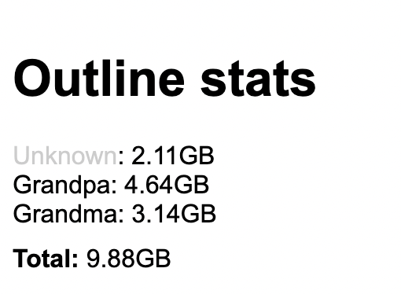

# Outline Web

Minimalistic web interface for Outline



# Installation (with nginx)

- [Download archive](https://github.com/Reeywhaar/outline_web/releases/latest/download/outline_web.zip)
- Unpack it to, /out/outline_web (for example)
- Create systemd service:
  - Create service file: `touch /lib/systemd/system/outline_web.service`
  - Put content inside:

```
[Unit]
Description=outline_web

[Service]
Type=simple
Restart=always
RestartSec=5s
User=root
WorkingDirectory=/opt/outline_web
ExecStart=/opt/outline_web/main
Environment="PORT=12345"
Environment="OUTLINE_API_URL=%PUT_API_URL_FROM_OUTLINE_MANAGER_HERE%"

[Install]
WantedBy=multi-user.target
```

- Install nginx
- Create nginx config
  - create .conf file `/etc/nginx/sites-available/outline_web.conf`
  - put contents inside:
  ```
  server {
  	listen 80;
  	server_name %PLACE_SERVER_NAME_HERE%;
  	location / {
  		access_log off;
  		proxy_pass http://127.0.0.1:12345;
  		proxy_set_header X-Real-IP $remote_addr;
  		proxy_set_header Host $host;
  		proxy_set_header X-Forwarded-For $proxy_add_x_forwarded_for;
  	}
  }
  ```
  - Replace %PUT_API_URL_FROM_OUTLINE_MANAGER_HERE% with api url obtained from server. To add multiple servers join urls with comma,
  - Enable conf `ln -sf /etc/nginx/sites-available/outline_web.conf /etc/nginx/sites-enabled/outline_web.conf`
  - Enable service and restart nginx:
  ```
  systemctl enable outline_web
  systemctl start outline_web
  service nginx restart
  ```
